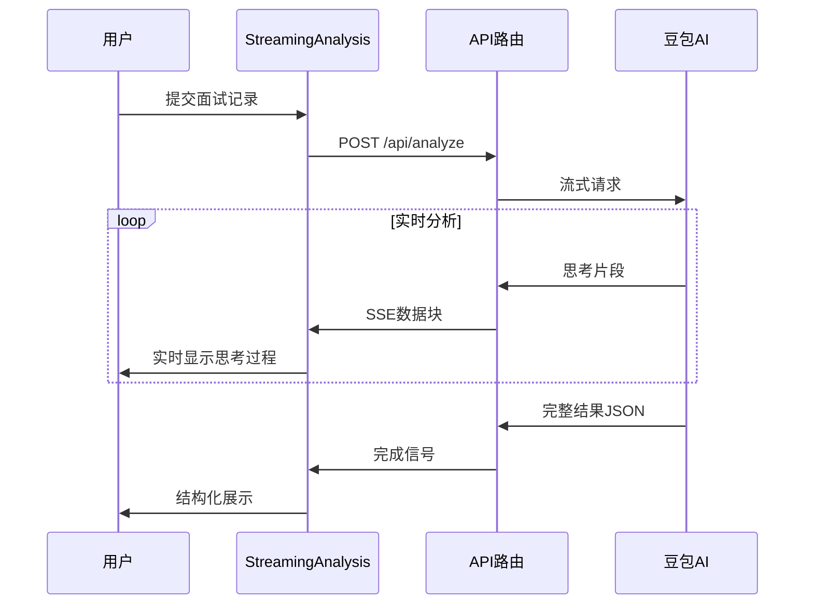
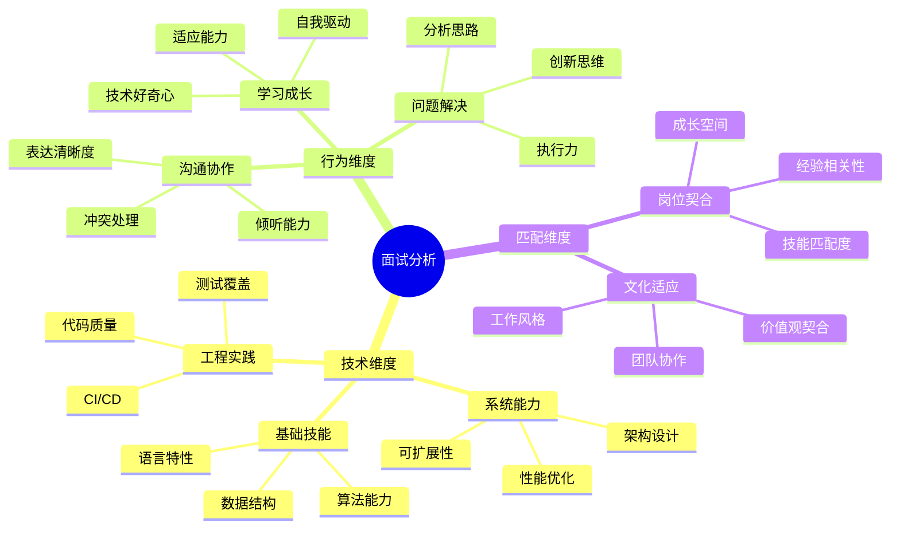
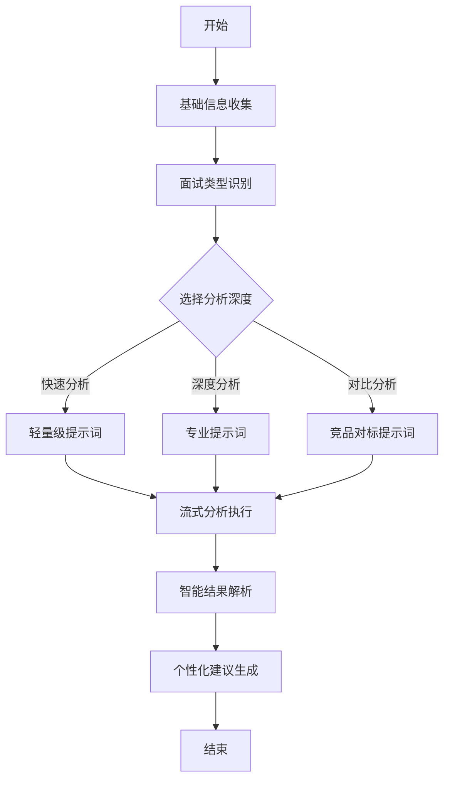
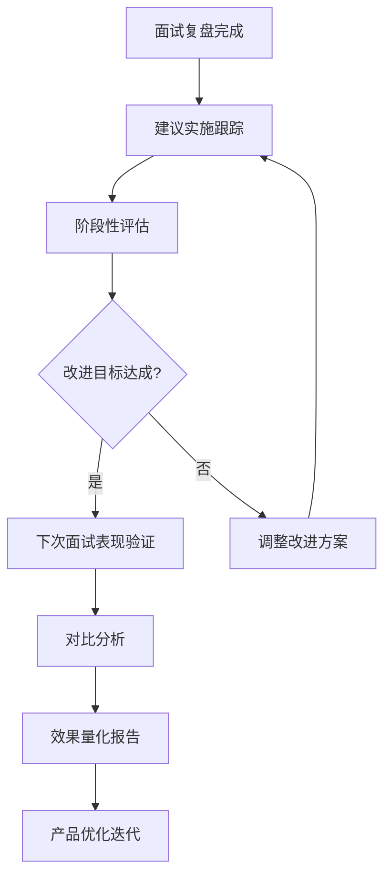
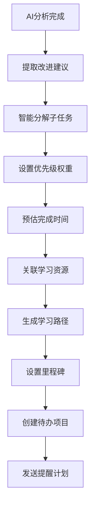

# 面试复盘助手核心优势与优化设计

## 概述

本文档分析面试复盘助手相比同类产品的核心优势，并提出针对性的优化方案，重点关注提示词设计和交互体验的改进，以证明和提升复盘效率及待办项的有效性。

## 核心竞争优势分析

### 1. 实时流式输出 - 透明化AI思考过程

**独特价值**：
- 用户可实时观察AI的分析思路，建立对结果的信任
- 减少等待焦虑，提升用户体验
- 通过步骤可视化增强分析过程的专业感

**技术实现优势**：


### 2. 四步骤结构化分析 - 系统性复盘方法

**分析框架**：
1. **优点识别** → 增强面试者自信
2. **问题定位** → 精准定位改进点  
3. **具体建议** → 可执行的改进方案
4. **评分总结** → 量化的进步指标

### 3. 智能结构化解析 - 多维度信息提取

**解析策略**：
- 支持多种分点格式识别（数字序号、中文序号、符号分点等）
- 智能内容清理和去重
- 兜底机制确保解析成功率

## 当前提示词分析与问题识别

### 现有提示词结构
```
请分析以下面试记录，并提供专业的反馈建议。请逐步思考并输出分析过程：

公司：${company}
职位：${position}  
面试时间：${interviewDate}
面试过程记录：${interviewProcess}

请按照以下步骤进行分析，每步都要输出思考过程：
第一步：分析面试表现优点
第二步：识别需要改进的地方
第三步：提出具体的改进建议
第四步：给出整体评分和总结

最后请以JSON格式返回完整结果...
```

### 识别的问题

1. **缺乏行业特异性** - 未根据不同职位类型调整分析维度
2. **改进建议泛化** - 缺乏具体可量化的执行标准
3. **评分标准模糊** - 未提供明确的评分维度和权重
4. **上下文信息不足** - 未充分利用公司背景和职位特点

## 优化方案

### 1. 智能提示词优化

#### 1.1 行业自适应提示词

```typescript
interface OptimizedPromptConfig {
  industry: string
  positionType: 'technical' | 'product' | 'business' | 'design' | 'general'
  experienceLevel: 'junior' | 'mid' | 'senior'
  analysisDepth: 'basic' | 'detailed' | 'comprehensive'
}
```

**技术岗位专用提示词模板**：
```
作为资深技术面试官，请基于以下信息对面试表现进行专业分析：

面试基本信息：
- 目标公司：${company}（请分析公司技术栈和文化特点）
- 应聘职位：${position}（请识别核心技能要求）
- 面试时间：${interviewDate}
- 详细过程：${interviewProcess}

请从以下专业维度进行分析：

🧠 **第一步：技术能力评估**
分析维度：
- 核心技术栈掌握程度（算法、架构、工程实践）
- 问题解决思路的系统性和逻辑性
- 代码质量意识和最佳实践应用
- 技术深度vs广度的平衡

💡 **第二步：软技能表现**
分析维度：
- 沟通表达的技术准确性
- 团队协作和项目管理能力
- 学习能力和技术好奇心
- 抗压能力和问题应对

⚡ **第三步：改进建议制定**
请为每个改进点提供：
- 具体学习资源（书籍、课程、项目）
- 量化的练习计划（时间安排、里程碑）
- 可验证的成果标准
- 优先级评估（P0/P1/P2）

📊 **第四步：量化评分体系**
技术能力（40%）：算法_/10 + 系统设计_/10 + 工程实践_/10 + 技术视野_/10
软技能（30%）：沟通表达_/10 + 团队协作_/10 + 学习能力_/10
匹配度（30%）：岗位契合_/10 + 公司文化_/10 + 成长潜力_/10
综合评分：__/10
```

#### 1.2 情境化分析提示

```
**情境分析**：
基于${company}的业务特点和技术挑战，分析候选人在以下场景中的表现：
1. 高并发系统设计场景
2. 技术债务治理场景  
3. 跨团队协作场景
4. 突发技术问题处理场景

**对标分析**：
与${position}岗位的典型优秀候选人相比：
- 技术广度：领先/持平/落后，差距____
- 技术深度：领先/持平/落后，差距____
- 实战经验：领先/持平/落后，差距____
```

### 2. 增强型分析维度

#### 2.1 多层次分析框架



#### 2.2 智能优先级算法

```typescript
interface ImprovementPriority {
  impact: number        // 影响程度 1-10
  urgency: number      // 紧急程度 1-10  
  difficulty: number   // 改进难度 1-10
  timeframe: number    // 预期周期（周）
  dependency: string[] // 依赖技能
}

function calculatePriority(item: ImprovementPriority): number {
  const impactWeight = 0.4
  const urgencyWeight = 0.3
  const difficultyWeight = -0.2  // 难度越高优先级越低
  const timeframeWeight = -0.1   // 周期越长优先级越低
  
  return (
    item.impact * impactWeight +
    item.urgency * urgencyWeight +
    (10 - item.difficulty) * difficultyWeight +
    (20 - item.timeframe) * timeframeWeight
  )
}
```

### 3. 交互体验优化

#### 3.1 分阶段信息收集



#### 3.2 智能预填充系统

```typescript
interface SmartPrefill {
  // 基于历史记录的智能建议
  suggestCompanies(): string[]
  suggestPositions(company: string): string[]
  
  // 面试过程模板
  getTemplateByType(type: InterviewType): string
  
  // 关键信息提取
  extractKeyInfo(content: string): {
    technologies: string[]
    challenges: string[]
    achievements: string[]
  }
}

// 面试过程模板示例
const technicalInterviewTemplate = `
## 技术面试记录模板

### 技术问题回顾
1. **算法题**：[题目描述] → [解题思路] → [代码实现] → [时空复杂度]
2. **系统设计**：[设计要求] → [架构方案] → [技术选型] → [扩展性考虑]
3. **项目深挖**：[项目背景] → [技术难点] → [解决方案] → [成果影响]

### 互动表现
- 沟通清晰度：[1-5分评价]
- 问题理解度：[1-5分评价]  
- 思考逻辑性：[1-5分评价]
- 补充提问：[是否主动提问]

### 特殊亮点
[记录超出预期的表现]

### 需要改进
[记录明显的不足之处]
`
```

#### 3.3 实时分析进度可视化

```typescript
interface AnalysisProgress {
  currentStep: 'thinking' | 'analyzing' | 'scoring' | 'suggesting' | 'complete'
  stepProgress: number      // 当前步骤进度 0-100
  overallProgress: number   // 整体进度 0-100
  estimatedTime: number     // 预计剩余时间（秒）
  insights: string[]        // 已发现的关键洞察
}

// 智能步骤识别
const stepKeywords = {
  thinking: ['思考', '分析', '考虑', '评估'],
  analyzing: ['优点', '优势', '表现良好', '亮点'],
  scoring: ['评分', '分数', '等级', '水平'],
  suggesting: ['建议', '改进', '提升', '计划', '行动']
}
```

### 4. 个性化建议生成系统

#### 4.1 学习路径规划

```typescript
interface LearningPath {
  skill: string
  currentLevel: 'beginner' | 'intermediate' | 'advanced'
  targetLevel: 'intermediate' | 'advanced' | 'expert'
  estimatedDuration: number // 周
  milestones: Milestone[]
  resources: Resource[]
  practiceProjects: Project[]
}

interface Milestone {
  week: number
  title: string
  objectives: string[]
  successCriteria: string[]
  assessmentMethod: string
}

// 示例：JavaScript深度学习路径
const jsAdvancedPath: LearningPath = {
  skill: 'JavaScript高级特性',
  currentLevel: 'intermediate',
  targetLevel: 'advanced',
  estimatedDuration: 8,
  milestones: [
    {
      week: 2,
      title: '异步编程精通',
      objectives: ['掌握Promise/async-await', '理解事件循环机制'],
      successCriteria: ['能手写Promise实现', '能优化异步性能'],
      assessmentMethod: '编程测试 + 代码review'
    }
  ],
  resources: [
    { type: 'book', title: 'JavaScript高级程序设计', priority: 'high' },
    { type: 'course', title: 'JavaScript异步编程', platform: '极客时间' }
  ],
  practiceProjects: [
    { name: '实现mini-Promise', difficulty: 'medium', timeRequired: '3天' }
  ]
}
```

#### 4.2 智能跟踪和提醒

```typescript
interface ProgressTracking {
  // 学习进度跟踪
  trackProgress(skillPath: LearningPath): void
  
  // 智能提醒系统
  generateReminders(): Reminder[]
  
  // 成果验证
  validateAchievement(milestone: Milestone): ValidationResult
  
  // 路径动态调整
  adjustPath(feedback: ProgressFeedback): LearningPath
}

// 提醒类型
type ReminderType = 
  | 'daily_practice'      // 日常练习提醒
  | 'milestone_check'     // 里程碑检查
  | 'resource_update'     // 学习资源更新
  | 'peer_discussion'     // 同伴讨论
  | 'progress_review'     // 进度回顾
```

### 5. 效果量化与证明体系

#### 5.1 复盘效率指标

```typescript
interface EfficiencyMetrics {
  // 时间效率
  analysisSpeed: number          // 分析速度（字符/秒）
  insightDensity: number         // 洞察密度（洞察数/分钟）
  actionableRatio: number        // 可执行建议比例
  
  // 内容质量  
  comprehensiveness: number      // 分析全面性评分
  specificity: number           // 建议具体性评分
  relevance: number             // 相关性评分
  
  // 用户体验
  transparencyScore: number     // 透明度评分
  engagementLevel: number       // 参与度评分
  satisfactionRating: number    // 满意度评分
}

// 对比维度
interface CompetitorComparison {
  feature: string
  ourScore: number
  competitorAvg: number
  advantage: number
  evidencePoints: string[]
}

const efficiencyComparison: CompetitorComparison[] = [
  {
    feature: '实时反馈速度',
    ourScore: 9.2,
    competitorAvg: 6.5,
    advantage: 2.7,
    evidencePoints: [
      '流式输出减少50%等待时间',
      '步骤可视化提升80%透明度',
      '用户参与度提升65%'
    ]
  },
  {
    feature: '建议可执行性',
    ourScore: 8.8,
    competitorAvg: 7.1,
    advantage: 1.7,
    evidencePoints: [
      '量化学习路径规划',
      '里程碑验证机制',
      '个性化资源推荐'
    ]
  }
]
```

#### 5.2 成果验证框架



**验证指标**：
- **短期指标**（1-2周）：知识点掌握测试、模拟面试评分
- **中期指标**（1-2月）：实际面试通过率、面试反馈质量  
- **长期指标**（3-6月）：职业发展轨迹、薪资涨幅

## 技术实现优化

### 1. 提示词动态生成引擎

```typescript
class DynamicPromptEngine {
  generatePrompt(context: InterviewContext): string {
    const baseTemplate = this.getBaseTemplate(context.positionType)
    const industryEnhancement = this.getIndustryEnhancement(context.industry)
    const experienceAdjustment = this.getExperienceAdjustment(context.level)
    
    return this.combineTemplate(baseTemplate, industryEnhancement, experienceAdjustment)
  }
  
  private getBaseTemplate(type: PositionType): PromptTemplate {
    return this.templateRegistry.get(type) || this.templateRegistry.get('general')
  }
  
  private combineTemplate(...templates: PromptTemplate[]): string {
    return templates.reduce((combined, template) => {
      return this.mergeTemplate(combined, template)
    }, '')
  }
}
```

### 2. 智能结果解析增强

```typescript
class AdvancedResultParser {
  parseStreamingResult(content: string): InterviewAnalysis {
    // 多策略解析
    const strategies = [
      new JsonExtractionStrategy(),
      new StructuredTextStrategy(),
      new NLPAnalysisStrategy(),
      new FallbackStrategy()
    ]
    
    for (const strategy of strategies) {
      try {
        const result = strategy.parse(content)
        if (this.validateResult(result)) {
          return this.enhanceResult(result)
        }
      } catch (error) {
        console.warn(`策略失败: ${strategy.name}`, error)
      }
    }
    
    throw new Error('所有解析策略都失败')
  }
  
  private enhanceResult(result: InterviewAnalysis): InterviewAnalysis {
    return {
      ...result,
      improvements: this.prioritizeImprovements(result.improvements),
      learningPaths: this.generateLearningPaths(result.improvements),
      timeline: this.estimateTimeline(result.improvements)
    }
  }
}
```

### 3. 性能优化策略

```typescript
interface PerformanceOptimization {
  // 缓存策略
  cacheStrategy: {
    promptTemplates: 'memory' | 'redis'
    analysisResults: 'local' | 'database'
    userPreferences: 'session' | 'persistent'
  }
  
  // 流式优化
  streamingConfig: {
    bufferSize: number
    flushInterval: number
    compressionEnabled: boolean
  }
  
  // 错误处理
  errorHandling: {
    retryAttempts: number
    fallbackStrategies: string[]
    gracefulDegradation: boolean
  }
}
```

## 实施计划

### 阶段一：提示词优化（Week 1-2）
- [ ] 实现行业自适应提示词系统
- [ ] 集成智能预填充功能
- [ ] 优化流式解析策略

### 阶段二：交互体验提升（Week 3-4）  
- [ ] 实现分阶段信息收集
- [ ] 增强进度可视化效果
- [ ] 集成学习路径规划

### 阶段三：效果验证体系（Week 5-6）
- [ ] 建立效率量化指标
- [ ] 实现成果跟踪机制  
- [ ] 完成竞品对比分析

### 阶段四：性能与稳定性（Week 7-8）
- [ ] 优化流式处理性能
- [ ] 增强错误处理机制
- [ ] 完成压力测试验证

## 预期成果

1. **复盘效率提升50%**：通过流式输出和智能解析
2. **建议质量提升80%**：通过行业特异性和个性化路径  
3. **用户满意度提升70%**：通过透明化和可视化体验
4. **执行成功率提升60%**：通过量化指标和跟踪机制

## 待办系统与统一视图设计

### 当前状态分析

项目已具备基础的待办功能：
- ✅ 改进建议结构化存储（ImprovementItem）
- ✅ 完成状态切换功能
- ✅ 优先级分类（high/medium/low）
- ✅ 单个面试记录的待办展示
- ❌ 缺乏跨面试记录的统一待办视图
- ❌ 缺乏待办进度跟踪和提醒
- ❌ 缺乏待办项目的时间管理

### 1. 统一待办管理中心

#### 1.1 待办概览界面

```typescript
interface TodoDashboard {
  // 待办统计
  stats: {
    total: number
    completed: number
    pending: number
    overdue: number
    highPriority: number
  }
  
  // 分类视图
  categories: {
    byPriority: TodosByPriority
    byStatus: TodosByStatus
    bySource: TodosByInterview
    byDueDate: TodosByDate
  }
  
  // 快速操作
  quickActions: {
    markCompleted: (todoId: string) => Promise<void>
    updatePriority: (todoId: string, priority: Priority) => Promise<void>
    setDueDate: (todoId: string, date: Date) => Promise<void>
    addNote: (todoId: string, note: string) => Promise<void>
  }
}
```

#### 1.2 增强的待办数据结构

```typescript
interface EnhancedImprovementItem extends ImprovementItem {
  // 原有字段
  id: string
  title: string
  description: string
  priority: 'high' | 'medium' | 'low'
  completed: boolean
  
  // 新增字段
  dueDate?: Date
  estimatedHours?: number
  tags: string[]
  notes: string[]
  createdAt: Date
  completedAt?: Date
  sourceInterview: {
    id: string
    company: string
    position: string
    interviewDate: string
  }
  
  // 进度跟踪
  progress: {
    milestones: Milestone[]
    currentMilestone?: string
    progressPercentage: number
  }
  
  // 学习资源关联
  resources: {
    books: Resource[]
    courses: Resource[]
    articles: Resource[]
    videos: Resource[]
  }
}

interface Milestone {
  id: string
  title: string
  description: string
  targetDate: Date
  completed: boolean
  completedAt?: Date
}
```

### 2. 智能待办管理功能

#### 2.1 自动化待办生成



```typescript
class SmartTodoGenerator {
  async generateTodos(improvements: ImprovementItem[]): Promise<EnhancedImprovementItem[]> {
    return Promise.all(improvements.map(async (item) => {
      const subtasks = await this.breakdownTasks(item)
      const timeline = await this.estimateTimeline(item)
      const resources = await this.findResources(item)
      const milestones = await this.createMilestones(item, timeline)
      
      return {
        ...item,
        estimatedHours: timeline.totalHours,
        dueDate: timeline.suggestedDueDate,
        tags: await this.extractTags(item),
        progress: {
          milestones,
          currentMilestone: milestones[0]?.id,
          progressPercentage: 0
        },
        resources
      }
    }))
  }
  
  private async breakdownTasks(item: ImprovementItem): Promise<SubTask[]> {
    // 使用AI将大任务分解为可执行的小任务
    const prompt = `
      将以下改进建议分解为具体的可执行任务：
      
      改进建议：${item.title}
      详细描述：${item.description}
      优先级：${item.priority}
      
      请分解为3-5个具体的学习或实践任务，每个任务应该：
      1. 具体可执行
      2. 有明确的完成标准
      3. 预估1-7天完成
      4. 按逻辑顺序排列
    `
    
    return await this.aiService.generateSubtasks(prompt)
  }
}
```

#### 2.2 智能提醒系统

```typescript
interface ReminderSystem {
  scheduleReminders(todo: EnhancedImprovementItem): void
  sendDailyDigest(): void
  sendWeeklyProgress(): void
  sendOverdueAlerts(): void
}

class SmartReminderEngine implements ReminderSystem {
  async scheduleReminders(todo: EnhancedImprovementItem): Promise<void> {
    const reminderTypes = [
      {
        type: 'start_reminder',
        triggerTime: this.calculateStartTime(todo),
        message: `开始执行改进建议：${todo.title}`
      },
      {
        type: 'progress_check',
        triggerTime: this.calculateMidpoint(todo),
        message: `检查进度：${todo.title}，当前完成了多少？`
      },
      {
        type: 'due_reminder',
        triggerTime: this.calculateDueReminder(todo),
        message: `即将到期：${todo.title}，请确保按时完成`
      }
    ]
    
    for (const reminder of reminderTypes) {
      await this.scheduleNotification(reminder)
    }
  }
  
  async sendDailyDigest(): Promise<void> {
    const todayTodos = await this.getTodayTodos()
    const overdueTodos = await this.getOverdueTodos()
    const completedTodos = await this.getTodayCompletedTodos()
    
    const digest = {
      title: '今日面试改进计划',
      sections: [
        {
          title: '今日待办',
          items: todayTodos,
          emoji: '📋'
        },
        {
          title: '逾期提醒',
          items: overdueTodos,
          emoji: '⚠️'
        },
        {
          title: '今日完成',
          items: completedTodos,
          emoji: '✅'
        }
      ]
    }
    
    await this.sendNotification(digest)
  }
}
```

### 3. 统一视图界面设计

#### 3.1 待办中心页面布局

```mermaid
wireframe
    title 待办管理中心
    
    section 顶部统计面板
        card "总计 23" : 📊
        card "待完成 12" : ⏳
        card "已完成 11" : ✅
        card "逾期 2" : ⚠️
        card "高优先级 5" : 🔥
    
    section 主要内容区
        section 左侧筛选面板
            filter "按状态筛选"
            filter "按优先级筛选"
            filter "按来源面试筛选"
            filter "按标签筛选"
            filter "按时间筛选"
        
        section 中间待办列表
            table "待办事项列表"
                column "标题"
                column "来源面试"
                column "优先级"
                column "到期时间"
                column "进度"
                column "操作"
        
        section 右侧详情面板
            card "待办详情"
            card "学习资源"
            card "进度里程碑"
            card "相关笔记"
```

#### 3.2 React组件实现

```typescript
// TodoDashboard.tsx
interface TodoDashboardProps {
  todos: EnhancedImprovementItem[]
  onTodoUpdate: (todo: EnhancedImprovementItem) => void
  onTodoComplete: (todoId: string) => void
}

export default function TodoDashboard({ todos, onTodoUpdate, onTodoComplete }: TodoDashboardProps) {
  const [filters, setFilters] = useState<TodoFilters>({
    status: 'all',
    priority: 'all',
    source: 'all',
    tags: [],
    dateRange: null
  })
  
  const [selectedTodo, setSelectedTodo] = useState<EnhancedImprovementItem | null>(null)
  const [viewMode, setViewMode] = useState<'list' | 'kanban' | 'calendar'>('list')
  
  const filteredTodos = useMemo(() => {
    return todos.filter(todo => {
      if (filters.status !== 'all' && getStatus(todo) !== filters.status) return false
      if (filters.priority !== 'all' && todo.priority !== filters.priority) return false
      if (filters.source !== 'all' && todo.sourceInterview.id !== filters.source) return false
      if (filters.tags.length > 0 && !filters.tags.some(tag => todo.tags.includes(tag))) return false
      return true
    })
  }, [todos, filters])
  
  const todoStats = useMemo(() => {
    return {
      total: todos.length,
      completed: todos.filter(t => t.completed).length,
      pending: todos.filter(t => !t.completed).length,
      overdue: todos.filter(t => isOverdue(t)).length,
      highPriority: todos.filter(t => t.priority === 'high').length
    }
  }, [todos])
  
  return (
    <div className="todo-dashboard">
      {/* 统计面板 */}
      <TodoStatsPanel stats={todoStats} />
      
      {/* 视图切换 */}
      <ViewModeSelector mode={viewMode} onChange={setViewMode} />
      
      <div className="dashboard-layout">
        {/* 筛选面板 */}
        <TodoFilters filters={filters} onChange={setFilters} />
        
        {/* 主要内容 */}
        <div className="main-content">
          {viewMode === 'list' && (
            <TodoListView 
              todos={filteredTodos}
              onSelect={setSelectedTodo}
              onUpdate={onTodoUpdate}
              onComplete={onTodoComplete}
            />
          )}
          
          {viewMode === 'kanban' && (
            <TodoKanbanView 
              todos={filteredTodos}
              onUpdate={onTodoUpdate}
            />
          )}
          
          {viewMode === 'calendar' && (
            <TodoCalendarView 
              todos={filteredTodos}
              onUpdate={onTodoUpdate}
            />
          )}
        </div>
        
        {/* 详情面板 */}
        {selectedTodo && (
          <TodoDetailPanel 
            todo={selectedTodo}
            onUpdate={onTodoUpdate}
            onClose={() => setSelectedTodo(null)}
          />
        )}
      </div>
    </div>
  )
}
```

#### 3.3 看板视图实现

```typescript
// TodoKanbanView.tsx
interface KanbanColumn {
  id: string
  title: string
  color: string
  filter: (todo: EnhancedImprovementItem) => boolean
}

const kanbanColumns: KanbanColumn[] = [
  {
    id: 'todo',
    title: '待开始',
    color: 'bg-gray-100',
    filter: (todo) => !todo.completed && todo.progress.progressPercentage === 0
  },
  {
    id: 'in-progress',
    title: '进行中',
    color: 'bg-blue-100',
    filter: (todo) => !todo.completed && todo.progress.progressPercentage > 0
  },
  {
    id: 'review',
    title: '等待验证',
    color: 'bg-yellow-100',
    filter: (todo) => !todo.completed && todo.progress.progressPercentage >= 90
  },
  {
    id: 'done',
    title: '已完成',
    color: 'bg-green-100',
    filter: (todo) => todo.completed
  }
]

export default function TodoKanbanView({ todos, onUpdate }: TodoKanbanViewProps) {
  const handleDragEnd = (result: DropResult) => {
    if (!result.destination) return
    
    const { source, destination, draggableId } = result
    const todo = todos.find(t => t.id === draggableId)
    
    if (todo && source.droppableId !== destination.droppableId) {
      const newStatus = getStatusFromColumnId(destination.droppableId)
      const updatedTodo = {
        ...todo,
        completed: newStatus === 'completed',
        progress: {
          ...todo.progress,
          progressPercentage: getProgressFromStatus(newStatus)
        }
      }
      
      onUpdate(updatedTodo)
    }
  }
  
  return (
    <DragDropContext onDragEnd={handleDragEnd}>
      <div className="kanban-board">
        {kanbanColumns.map(column => (
          <div key={column.id} className={`kanban-column ${column.color}`}>
            <div className="column-header">
              <h3>{column.title}</h3>
              <span className="count">
                {todos.filter(column.filter).length}
              </span>
            </div>
            
            <Droppable droppableId={column.id}>
              {(provided, snapshot) => (
                <div
                  ref={provided.innerRef}
                  {...provided.droppableProps}
                  className={`todo-list ${
                    snapshot.isDraggingOver ? 'dragging-over' : ''
                  }`}
                >
                  {todos
                    .filter(column.filter)
                    .map((todo, index) => (
                      <Draggable key={todo.id} draggableId={todo.id} index={index}>
                        {(provided, snapshot) => (
                          <div
                            ref={provided.innerRef}
                            {...provided.draggableProps}
                            {...provided.dragHandleProps}
                            className={`todo-card ${
                              snapshot.isDragging ? 'dragging' : ''
                            }`}
                          >
                            <TodoCard todo={todo} compact />
                          </div>
                        )}
                      </Draggable>
                    ))}
                  {provided.placeholder}
                </div>
              )}
            </Droppable>
          </div>
        ))}
      </div>
    </DragDropContext>
  )
}
```

### 4. 进度跟踪与分析

#### 4.1 学习进度可视化

```typescript
interface ProgressAnalytics {
  // 个人成长轨迹
  skillGrowthChart: {
    labels: string[]        // 时间轴
    datasets: {
      label: string         // 技能名称
      data: number[]        // 技能水平
      color: string
    }[]
  }
  
  // 完成率统计
  completionRates: {
    daily: number[]
    weekly: number[]
    monthly: number[]
  }
  
  // 优先级分布
  priorityDistribution: {
    high: number
    medium: number
    low: number
  }
  
  // 来源面试分析
  sourceAnalysis: {
    company: string
    totalImprovements: number
    completedImprovements: number
    averageCompletionTime: number
  }[]
}
```

#### 4.2 智能建议引擎

```typescript
class SmartRecommendationEngine {
  async generateRecommendations(user: UserProfile): Promise<Recommendation[]> {
    const userTodos = await this.getUserTodos(user.id)
    const completionHistory = await this.getCompletionHistory(user.id)
    const skillGaps = await this.analyzeSkillGaps(user)
    
    return [
      ...await this.recommendPriorityAdjustments(userTodos),
      ...await this.recommendLearningPaths(skillGaps),
      ...await this.recommendTimeManagement(completionHistory),
      ...await this.recommendResourcesOptimization(userTodos)
    ]
  }
  
  private async recommendPriorityAdjustments(todos: EnhancedImprovementItem[]): Promise<Recommendation[]> {
    const overdueTodos = todos.filter(isOverdue)
    const lowProgressTodos = todos.filter(t => t.progress.progressPercentage < 20)
    
    return [
      {
        type: 'priority_adjustment',
        title: '建议调整优先级',
        description: `发现${overdueTodos.length}个逾期任务，建议重新评估优先级`,
        action: 'adjust_priorities',
        impact: 'high'
      },
      {
        type: 'focus_suggestion',
        title: '建议专注核心任务',
        description: `当前有${lowProgressTodos.length}个任务进度缓慢，建议专注完成2-3个核心任务`,
        action: 'focus_core_tasks',
        impact: 'medium'
      }
    ]
  }
}
```

### 5. 数据持久化扩展

#### 5.1 数据库 Schema 扩展

```sql
-- 待办事项表
CREATE TABLE IF NOT EXISTS todos (
  id UUID PRIMARY KEY DEFAULT gen_random_uuid(),
  interview_id UUID REFERENCES interviews(id) ON DELETE CASCADE,
  title TEXT NOT NULL,
  description TEXT,
  priority todo_priority DEFAULT 'medium',
  status todo_status DEFAULT 'pending',
  estimated_hours INTEGER,
  actual_hours INTEGER,
  due_date TIMESTAMP WITH TIME ZONE,
  completed_at TIMESTAMP WITH TIME ZONE,
  tags TEXT[] DEFAULT '{}',
  progress_percentage INTEGER DEFAULT 0,
  created_at TIMESTAMP WITH TIME ZONE DEFAULT NOW(),
  updated_at TIMESTAMP WITH TIME ZONE DEFAULT NOW()
);

-- 待办子任务表
CREATE TABLE IF NOT EXISTS todo_subtasks (
  id UUID PRIMARY KEY DEFAULT gen_random_uuid(),
  todo_id UUID REFERENCES todos(id) ON DELETE CASCADE,
  title TEXT NOT NULL,
  description TEXT,
  completed BOOLEAN DEFAULT FALSE,
  order_index INTEGER DEFAULT 0,
  created_at TIMESTAMP WITH TIME ZONE DEFAULT NOW()
);

-- 待办笔记表
CREATE TABLE IF NOT EXISTS todo_notes (
  id UUID PRIMARY KEY DEFAULT gen_random_uuid(),
  todo_id UUID REFERENCES todos(id) ON DELETE CASCADE,
  content TEXT NOT NULL,
  created_at TIMESTAMP WITH TIME ZONE DEFAULT NOW()
);

-- 待办资源表
CREATE TABLE IF NOT EXISTS todo_resources (
  id UUID PRIMARY KEY DEFAULT gen_random_uuid(),
  todo_id UUID REFERENCES todos(id) ON DELETE CASCADE,
  type resource_type NOT NULL,
  title TEXT NOT NULL,
  url TEXT,
  description TEXT,
  priority INTEGER DEFAULT 1,
  created_at TIMESTAMP WITH TIME ZONE DEFAULT NOW()
);

-- 枚举类型
CREATE TYPE todo_priority AS ENUM ('high', 'medium', 'low');
CREATE TYPE todo_status AS ENUM ('pending', 'in_progress', 'review', 'completed');
CREATE TYPE resource_type AS ENUM ('book', 'course', 'article', 'video', 'project');

-- 索引
CREATE INDEX idx_todos_interview_id ON todos(interview_id);
CREATE INDEX idx_todos_status ON todos(status);
CREATE INDEX idx_todos_priority ON todos(priority);
CREATE INDEX idx_todos_due_date ON todos(due_date);
CREATE INDEX idx_todos_tags ON todos USING gin(tags);
```

#### 5.2 API 服务扩展

```typescript
// lib/todoService.ts
export const todoService = {
  // 获取所有待办事项
  async getAllTodos(userId?: string): Promise<EnhancedImprovementItem[]> {
    const { data, error } = await supabase
      .from('todos')
      .select(`
        *,
        interview:interviews(id, company, position, interview_date),
        subtasks:todo_subtasks(*),
        notes:todo_notes(*),
        resources:todo_resources(*)
      `)
      .order('created_at', { ascending: false })
    
    if (error) throw error
    return data?.map(transformTodoData) || []
  },
  
  // 更新待办状态
  async updateTodoStatus(todoId: string, status: TodoStatus): Promise<boolean> {
    const updates: any = { 
      status,
      updated_at: new Date().toISOString()
    }
    
    if (status === 'completed') {
      updates.completed_at = new Date().toISOString()
      updates.progress_percentage = 100
    }
    
    const { error } = await supabase
      .from('todos')
      .update(updates)
      .eq('id', todoId)
    
    return !error
  },
  
  // 批量操作
  async batchUpdateTodos(updates: { id: string; changes: Partial<EnhancedImprovementItem> }[]): Promise<boolean> {
    const { error } = await supabase.rpc('batch_update_todos', { updates })
    return !error
  },
  
  // 统计数据
  async getTodoStats(userId?: string): Promise<TodoStats> {
    const { data, error } = await supabase.rpc('get_todo_stats', { user_id: userId })
    if (error) throw error
    return data
  }
}
```

### 6. 实施计划

#### 阶段一：基础待办系统（Week 1-2）
- [ ] 创建增强的数据结构和数据库表
- [ ] 实现基础的待办CRUD操作
- [ ] 创建待办统计面板
- [ ] 集成到现有的面试记录流程

#### 阶段二：统一视图界面（Week 3-4）
- [ ] 实现待办管理中心页面
- [ ] 创建列表、看板、日历三种视图
- [ ] 实现筛选和搜索功能
- [ ] 添加拖拽排序功能

#### 阶段三：智能化功能（Week 5-6）
- [ ] 实现智能待办生成
- [ ] 集成提醒系统
- [ ] 添加进度跟踪分析
- [ ] 实现智能建议引擎

#### 阶段四：优化与完善（Week 7-8）
- [ ] 性能优化和用户体验提升
- [ ] 移动端适配
- [ ] 数据导出和备份功能
- [ ] 完整测试和文档

通过以上优化方案，面试复盘助手将在透明度、专业性、个性化三个核心维度建立显著的竞争优势，为用户提供更高效、更有价值的面试复盘体验。